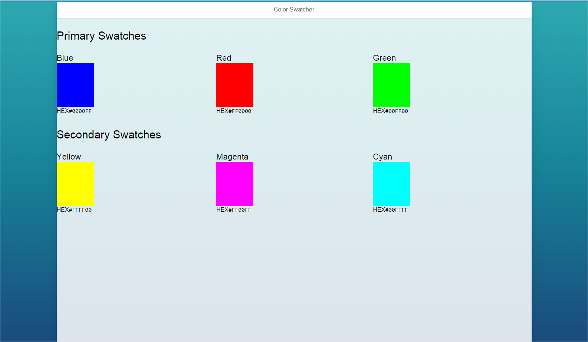

OpenUI5 Color Swatcher Sample Application
=========================================

Sample OpenUI5 application using/creating custom components. Clicking on a color swatch will copy the HEX value to your clipboard.

# About this project
This project demonstrates creating a new custom control (using JavaScript), and using the control from an XML view.

A JSON view model is used to bind data into the control, and those values are read from within the render function of the control.

# Contributing
Please submit issues/pull requests to help improve this sample.
